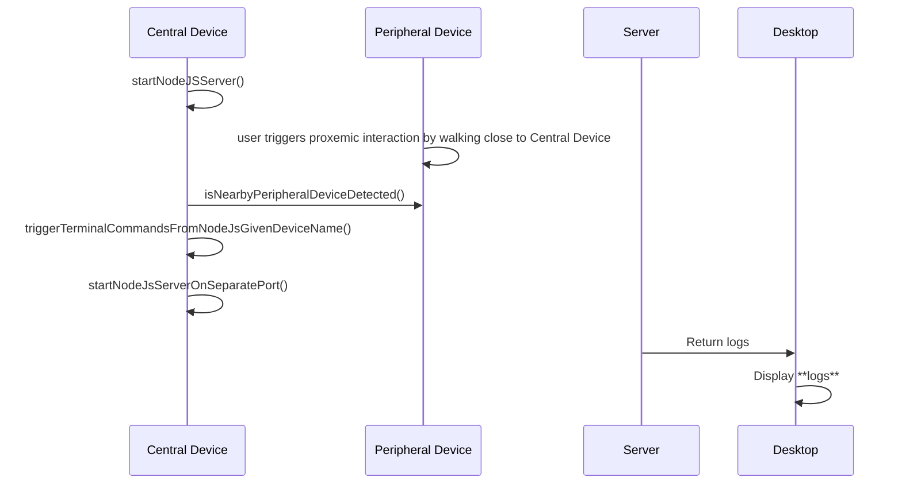

open this in Obsidian

```mermaid
sequenceDiagram
	Central Device->>Central Device: startNodeJSServer()
	Peripheral Device->>Peripheral Device: user triggers proxemic interaction by walking close to Central Device 
	Central Device->>Peripheral Device: isNearbyPeripheralDeviceDetected()
	Central Device->>Central Device: triggerTerminalCommandsFromNodeJsGivenDeviceName()
	Central Device->>Central Device: startNodeJsServerOnSeparatePort()
	Server->>Desktop: Return logs
	Desktop->>Desktop: Display **logs**
```